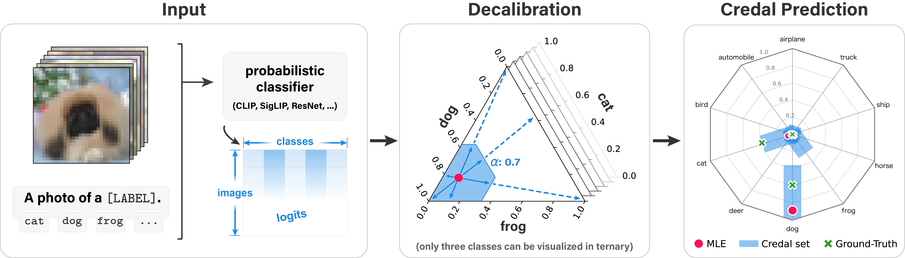

# Efficient Credal Prediction through Decalibration
A reliable representation of uncertainty is essential for the application of modern machine learning methods in safety-critical settings. In this regard, the use of credal sets (i.e., convex sets of probability distributions) has recently been proposed as a suitable approach to representing epistemic uncertainty.
However, as with other approaches to epistemic uncertainty, training credal predictors is computationally complex and usually involves (re-)training an ensemble of models.
The resulting computational complexity prevents their adoption for complex models such as  foundation models and multi-modal systems.
To address this problem, we propose an efficient method for credal prediction that is grounded in the notion of relative likelihood and inspired by techniques for the calibration of probabilistic classifiers. For each class label, our method predicts a range of plausible probabilities in the form of an interval. To produce the lower and upper bounds of these intervals, we propose a techniques that we refer to as decalibration.
Extensive experiments show that our method yields credal sets with strong coverage and efficiency and performs well on out-of-distribution detection tasks. Notably, we demonstrate credal prediction on models such as TabPFN and CLIP–architectures for which the construction of credal sets was previously infeasible.
<div align="center">
  
</div>

## 🧩 Setup
The code is implemented in Python 3.12.
All dependencies can be installed via:
```bash
pip install -r requirements.txt
```


## 🚀 Usage
| **Task** | **Script** | **Description**                                                 |
|-----------|-------------|-----------------------------------------------------------------|
| Coverage, efficiency & OoD evaluation | `eval_cov_eff_ood.py` | Evaluates our method in coverage-efficiency and OoD performance |
| Active learning experiments | `eval_active_learning.py` | Evaluates our method in active learning settings                |
| Tabular experiments (TabPFN) | `eval_tabular.py` | Evaluates our method with TabPFN on tabular data                |
| CLIP-based experiments | `clip_*.py` | Evaluates our method with CLIP on multi-modal data              |
| Baselines | `eval_baseline_ood.py` | Evaluates standard uncertainty baselines in OoD settings        |
| Model definitions | `models.py` | Contains all model architectures and our decalibration method.  |
| Data loading | `data.py` | Handles datasets and preprocessing                              |
| Model training | `train_model.py` | Trains standard model                                           |
| Baseline training | `train_baselines.py` | Trains baseline models                                          |
| Plotting | `plotting.py` | Contains functions for visualization and figure generation      |

Example usage of our scripts (e.g. `train_model.py`):
```bash
python train_model.py \
            --dataset cifar10 \
            --validate False \
            --classes 10 \
            --model resnet \
            --n_members 20 \
            --optimizer sgd \
            --epochs 200 \
            --lr 0.1 \
            --wd 5e-4 \
            --tobias 100 \
            --seed $sd \
            --batch False
```

[//]: # (## 📚 Citation)

[//]: # ()
[//]: # (If you find this work useful, please cite our paper:)

